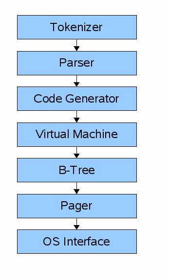

### Hello and welcome!
Welcome to my own Shot at Writing an SQLite Database from scratch.

Dont expect this documentation to be deep, i only will write the things that i think i would struggle to remember, its intended for self use!

Regardless, enjoy reading.

Here is the **Questions** im planning to answer for myself after getting this project done with.


- What format is data saved in? (in memory and on disk)
- When does it move from memory to disk?
- Why can there only be one primary key per table?
- How does rolling back a transaction work?
- How are indexes formatted?
- When and how does a full table scan happen?
- What format is a prepared statement saved in?

### Here is an overview of the SQLite Architecture


- The input to the "Front-end" is a SQL Query, the output is Sqlite virtual machine bytecode (Compiled program that can operate on the database)

The frontend consists of the
- Tokenizer
- parser
- code generator

The backend consists of the 
- Virtual Machine
- B-tree
- Pager
- OS Interface

The Virutal Machine Takes bytecode generated by the frontend as instructions.
- It performs those operations on one or more tables or indecies
- Each stored in a datastructure called B-Tree.

> Think of the VM as a big switch statement on the type of the bytecode instruction.

Each B-tree consists of many nodes. each node is one page in length, The B-tree can retrieve a page from disk or save it back by issuing commands to the pager.

The **Pager** Recieves commands to write/read pages of data, it is responsible for reading/writing at appropriate offsets in the database file, while also keeps a cache of recently-accessed pages in memory, and decides when those pages need to be written back to disk.

The **OS Interface** Differs depending on the Operating System SQLite was compiled on.

---

After Initiating a buffer to read from
to get a line of input we use [getline()](https://man7.org/linux/man-pages/man3/getline.3.html)
```C
ssize_t getline(char **lineptr, size_t *n, FILE *stream);
```

`lineptr` a pointer to the variable we use to point to the buffer containing the readline, if it set to NULL, it is mallocated by `getline` and should be freed by the user.
`n` a pointer to the variable we use to safe the size of allocated buffer.
`stream` the input stream to read from, I'll be reading from Standard Input.
`return value` the number of bytes read. which maybe less than the buffer size.
