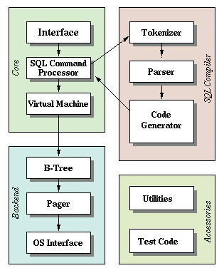

The "front-end" of sqlite is a SQL Compiler that parses a string and outputs an internal representation called bytecode.

This bytecode is passed to the virtual machine which executes it.

> SQLite Architecture (https://www.sqlite.org/arch.html)

Breaking things into steps like this has its advantages like:

- Reduces the complexity of each part (e.g. virtual machine does not worry about syntax errors)
- Allows compiling common queries once and caching the bytecode for improved performance
